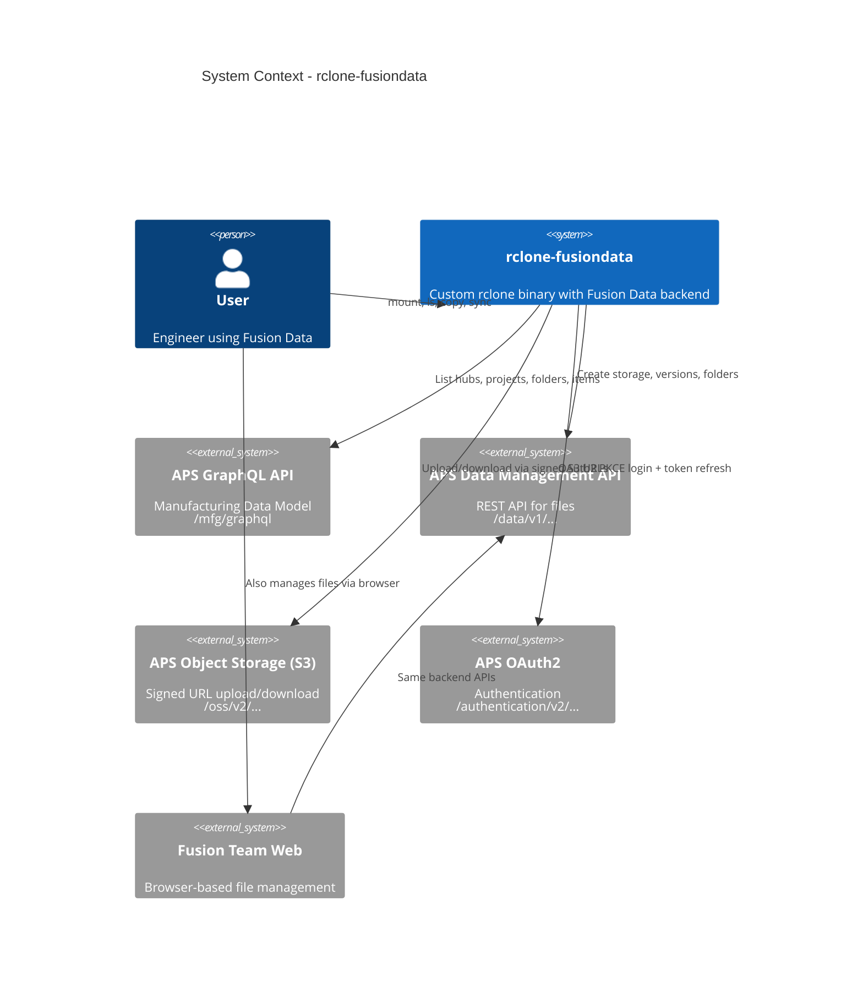
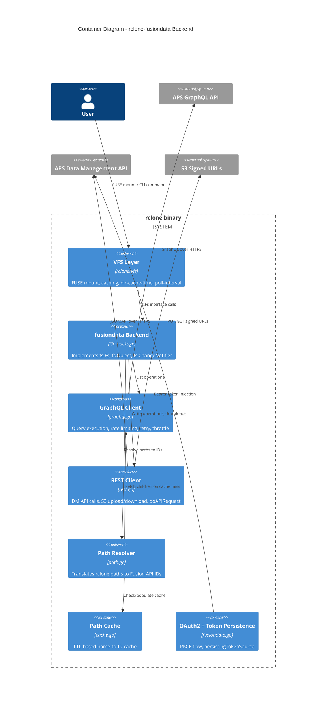
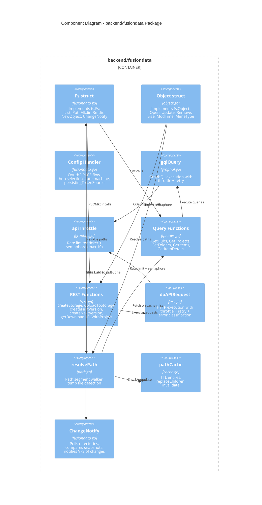
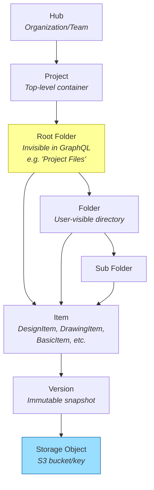

# Architecture

This document describes the architecture of the rclone-fusiondata backend using C4 model diagrams.

## C4 Level 1: System Context

How the rclone-fusiondata backend fits into the broader system.

## C4 Level 2: Container Diagram

The major components inside the rclone-fusiondata binary.

## C4 Level 3: Component Diagram

Detailed view of the fusiondata backend package.

## Data Model: Fusion Data Hierarchy

## API Mapping

| rclone Operation | API Used | Endpoint |
|---|---|---|
| List projects | GraphQL | `hub.projects` |
| List folders | GraphQL | `foldersByProject` |
| List items | GraphQL | `itemsByFolder` / `itemsByProject` |
| Item details | GraphQL | `item(hubId, itemId)` |
| Download file | REST + S3 | `GET .../items/.../tip` then `GET signeds3download` |
| Upload file | REST + S3 | `POST .../storage` then `GET signeds3upload` then `PUT` S3 |
| Create version | REST | `POST .../items` or `POST .../versions` |
| Create folder | REST | `POST .../folders` |
| Resolve folder DM IDs | REST | `GET .../topFolders` + `GET .../folders/.../contents` |

## Dual-ID System

Fusion Data uses two ID systems that the backend must bridge:

| System | Used For | Format |
|---|---|---|
| **GraphQL ID** | Listing, navigation, item details | Opaque string (e.g., `a]W5...`) |
| **DM API ID** | Upload, download, create, version | URN (e.g., `urn:adsk.wipprod:dm.lineage:XXXX`) |

- **Hubs and Projects** expose `alternativeIdentifiers` in GraphQL that provide the DM API ID
- **Folders** do NOT expose DM IDs in GraphQL; the backend resolves them by walking the REST `topFolders` and `contents` endpoints
- **Items** also lack DM IDs in GraphQL; resolved via REST `contents` endpoint by name matching
