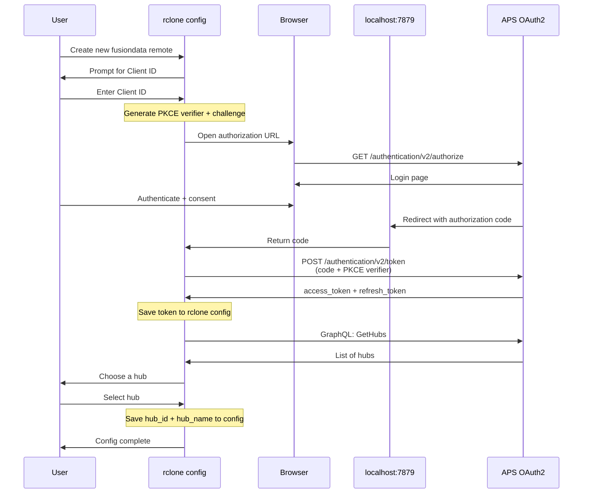
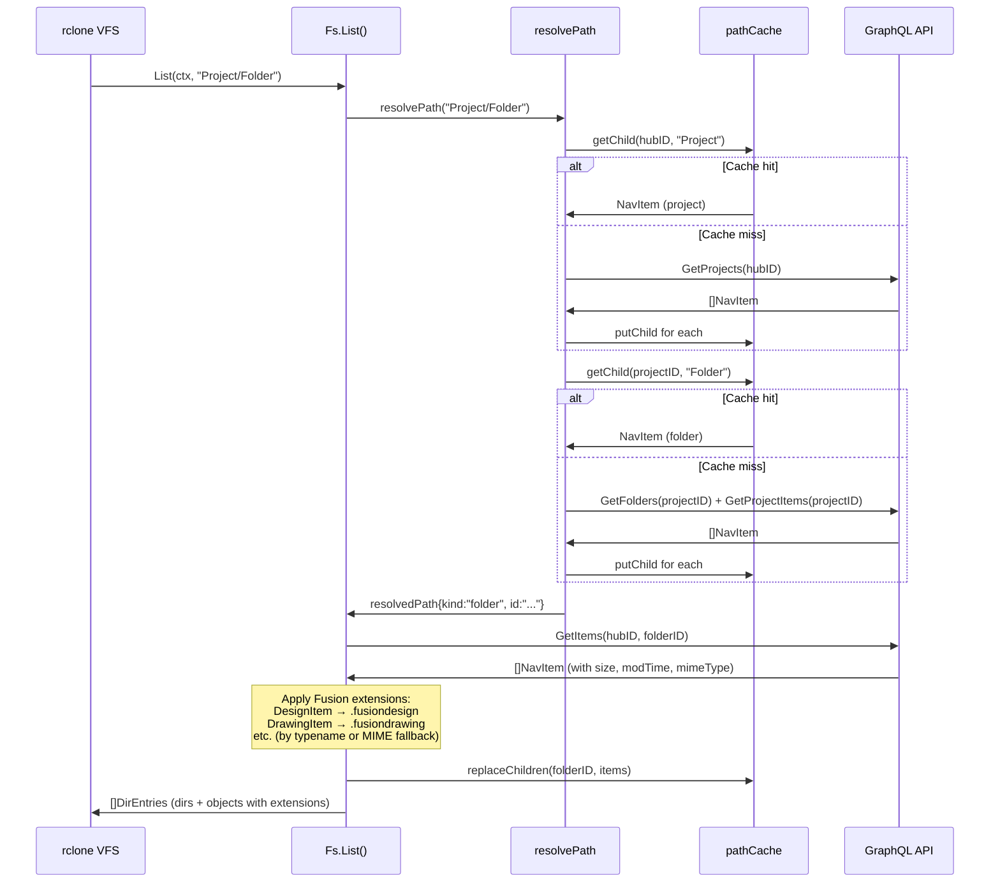
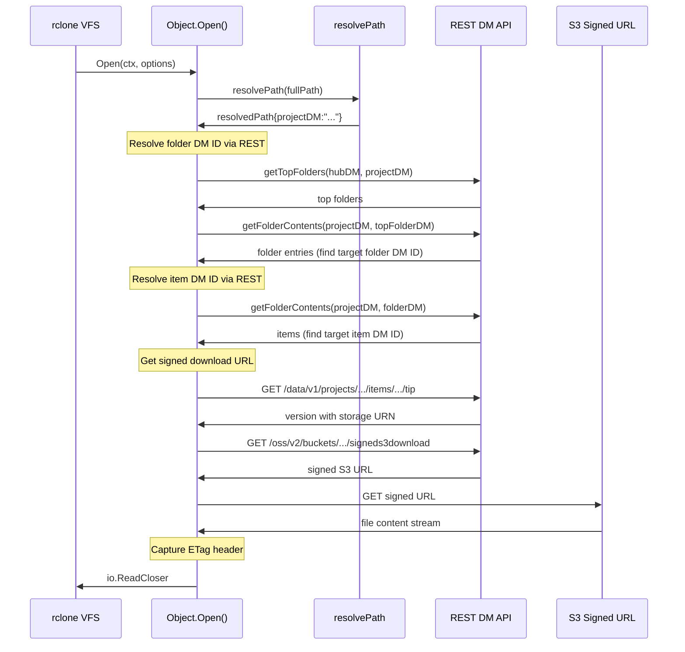
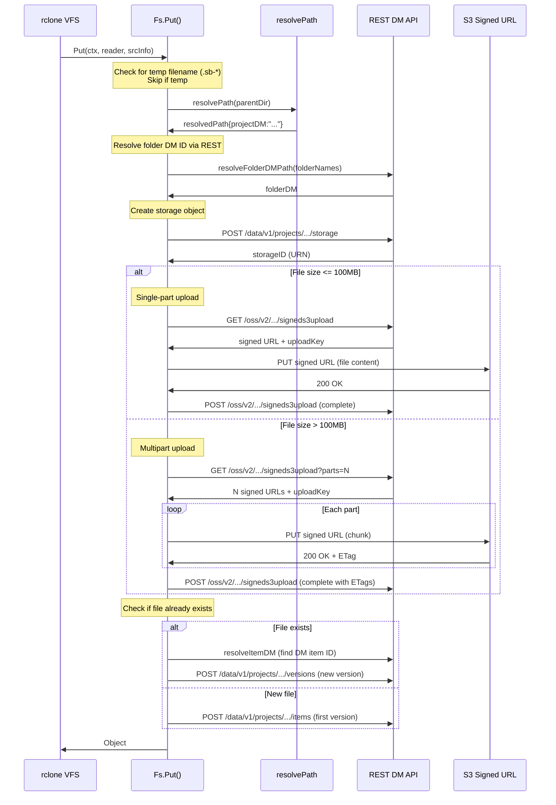
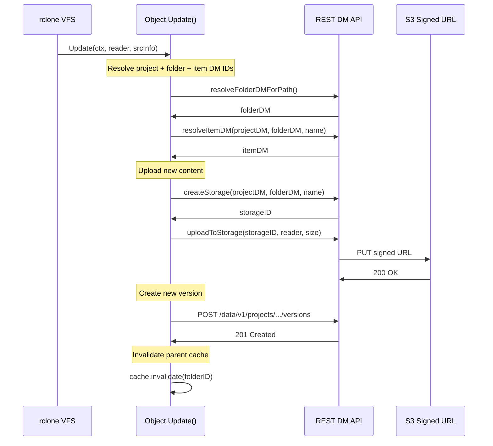
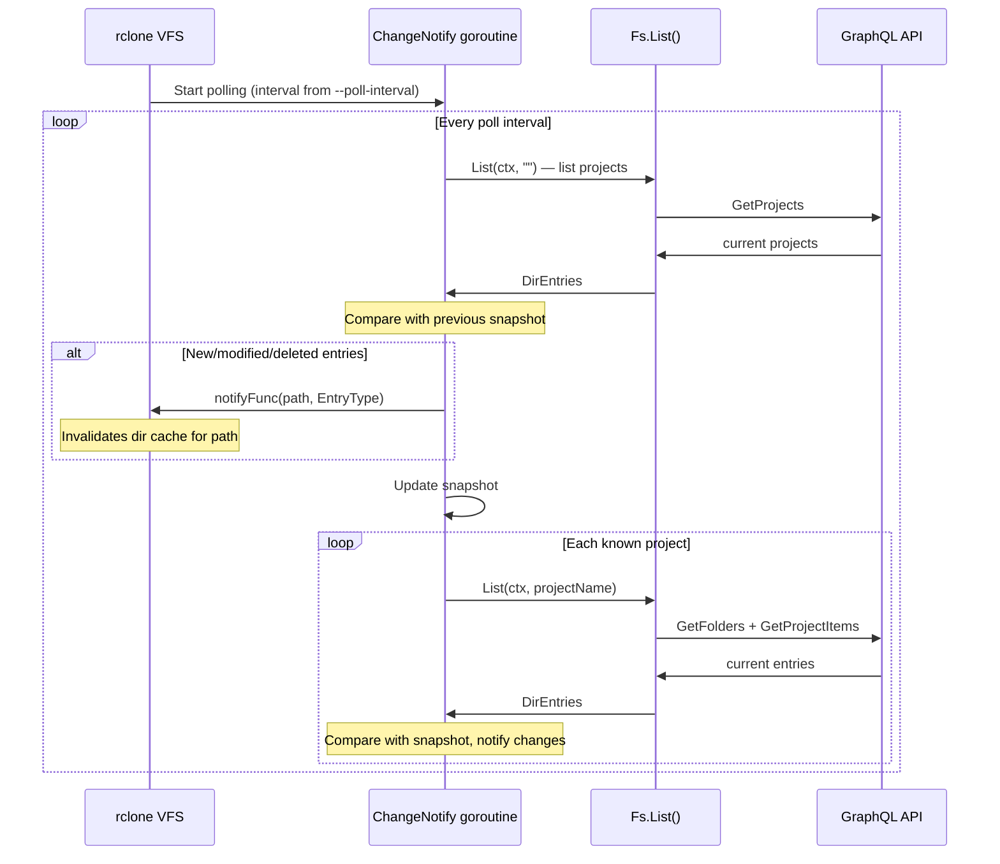
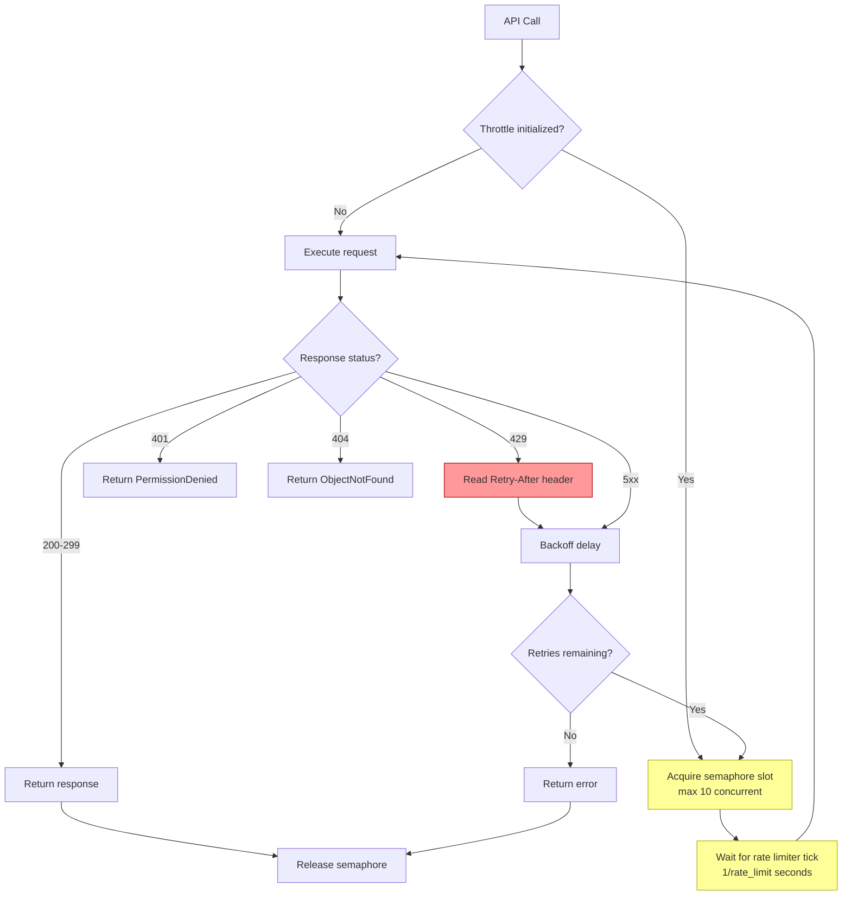
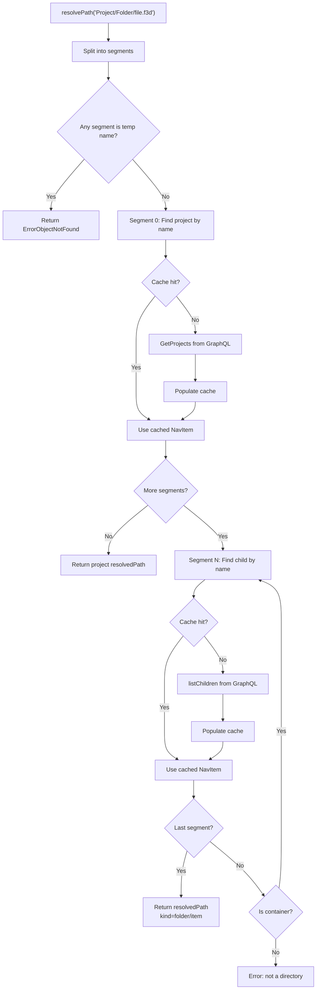

# Operation Flow Diagrams

Detailed sequence diagrams for each major operation in the fusiondata backend.

## Authentication Flow (rclone config)

## List Directory (rclone ls)

## Download File (Open)

## Upload New File (Put)

## Update Existing File (creates new version)

## Change Notification Polling (ChangeNotify)

## Rate Limiting and Throttle

## Path Resolution

